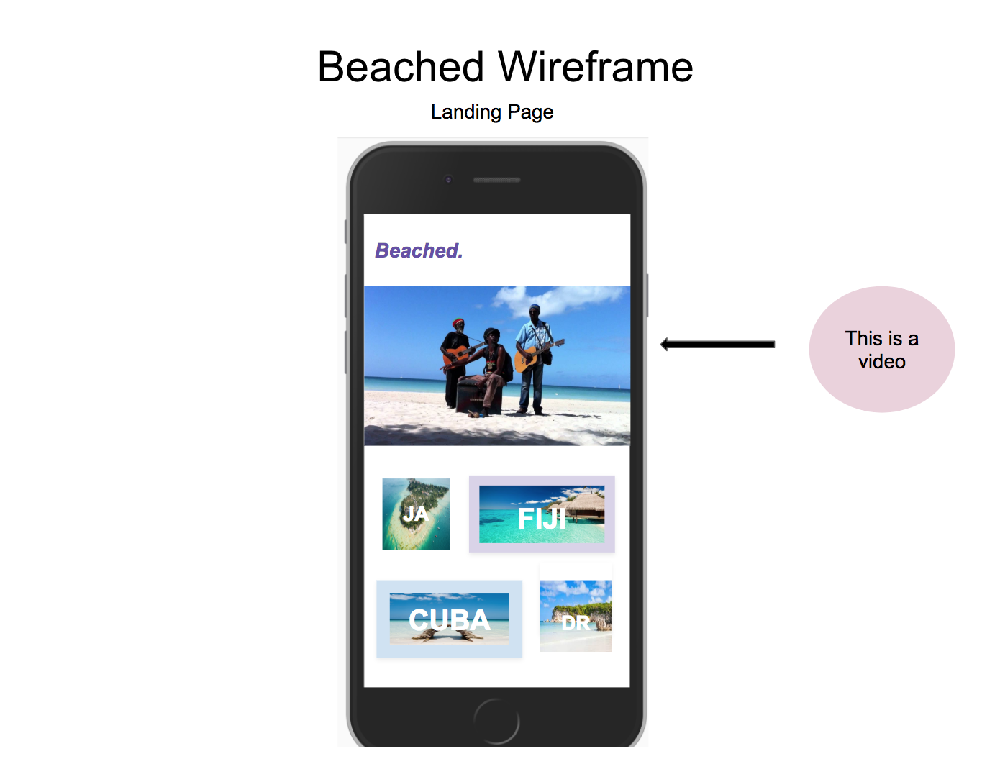
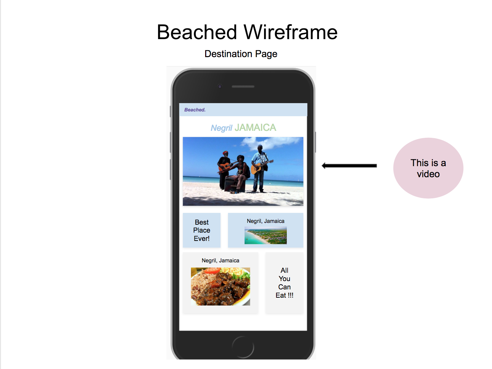
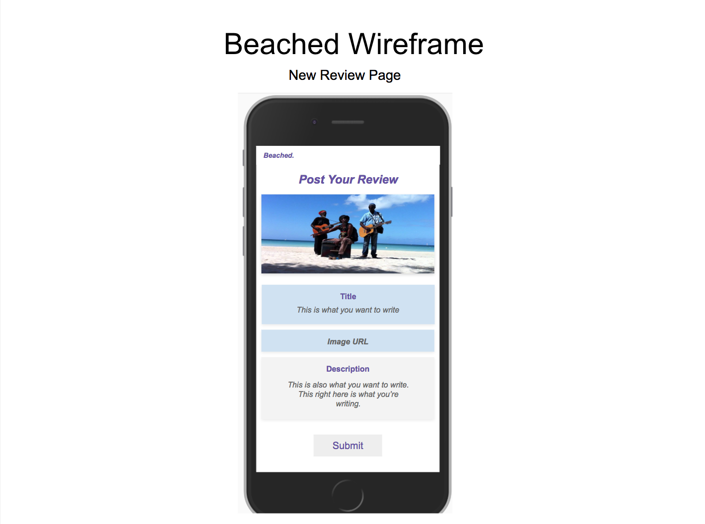
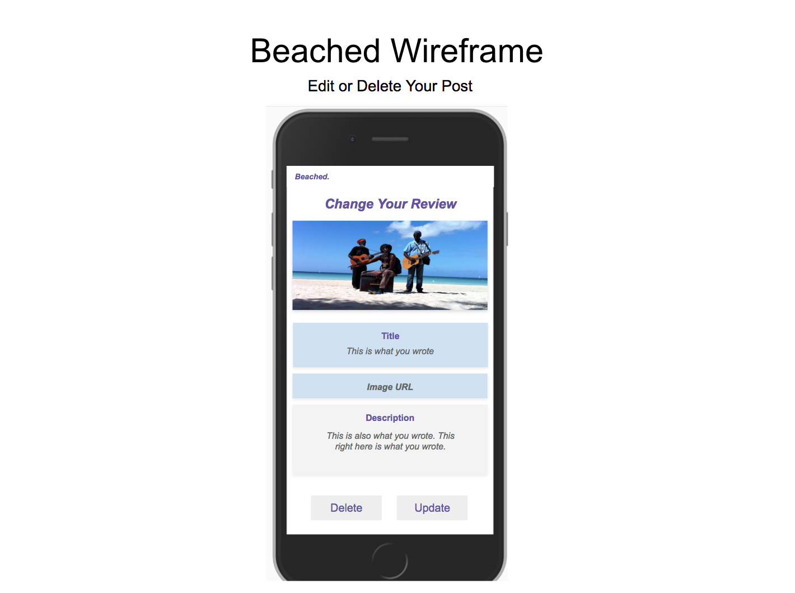
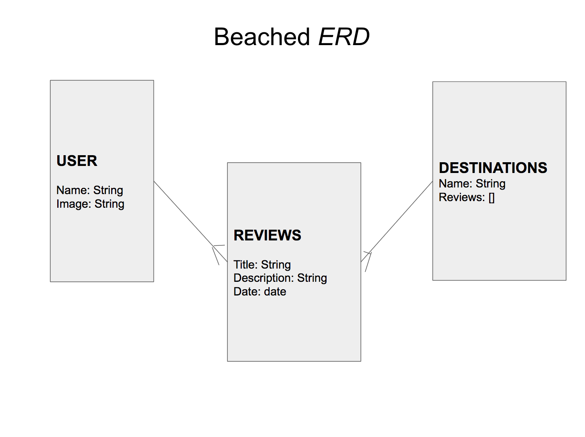

# Beached.
App that allows user to review their recent beach trips

**Link to Deployed App on Heroku:** 
<https://sleepy-tundra-82913.herokuapp.com/>

**Link to User Stories on Trello:** <https://trello.com/b/G3pphJr9/beached>

## Project Description

The goal of this project was to create a full stack application using the react on rails. Beached is an original idea and it is meant to be used to help users determine which beaches they'd like to visit. Users will be able to post the reviews for the beaches they've visited. Users are able to create, read, and delete their reviews. 

## Technologies Used

  * Frameworks - React, Ruby On Rails, Node.js, Postgresql
  * Languages - HTML5, CSS3, JavaScript, JSX
  * Wireframe - Google Slides - [Google Slides](https://docs.google.com/presentation/d/1vXcY9zgcwcRJi4kHSeFmI1rEmKl7ztXiFthhR3tslCk/edit?usp=sharing)
  * Project Planning & User Stories - [Trello](https://trello.com/b/G3pphJr9/beached)
  * Deployment - Heroku - [Heroku](https://sleepy-tundra-82913.herokuapp.com/)
  * Visual Studio Code
  * iTerm

## Features
 
  * ERD Data Model

## Wireframe

## Additions to a Future Version

  * Fixing Bugs
  * Adding to the styling
